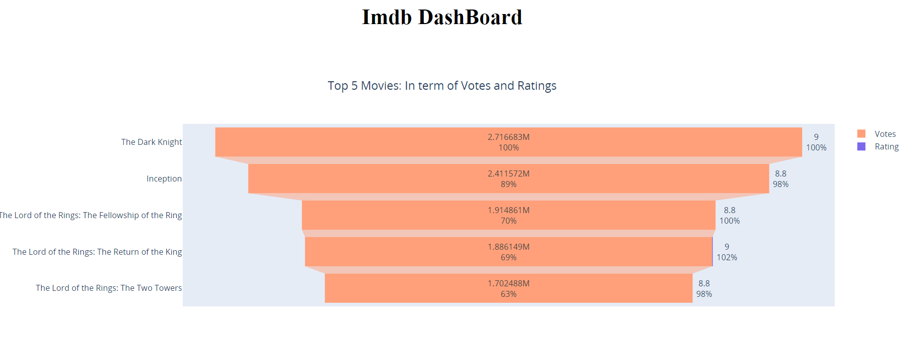
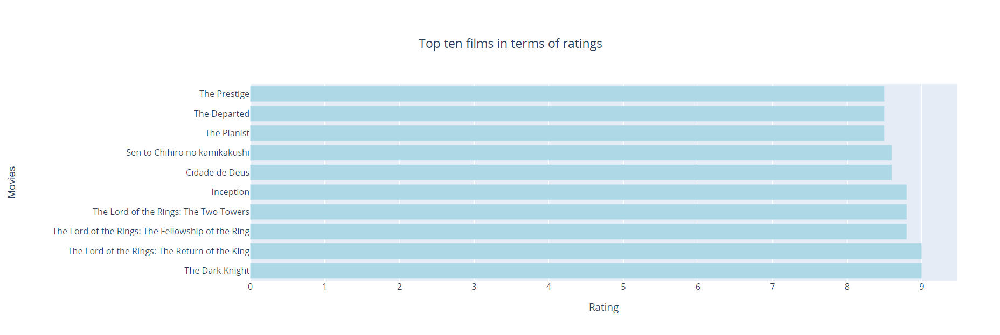

# WebAppDash

Here a web application using Dash and Plotly with data from Imdb.
The data contains feature films released between 2000-01-01 and 2010-12-31 (sorted by number of votes in descending order).

## Getting Started

  ### Usage
  ***
  First, install python dependencies:
    - $ pip install -r requirements.txt
  
  ***
   - The imdb.py file can be used to obtain data by web scraping with BeautifulSoop.
   - We'll then import the file into App.py.
 
 ### Visualization
 
  In the App.py file, we have different visualizations with : Here are some examples: 
  
  
  #### Plotly with FunnyPlot
     
   
   
  #### Plotly with Barplot
  
